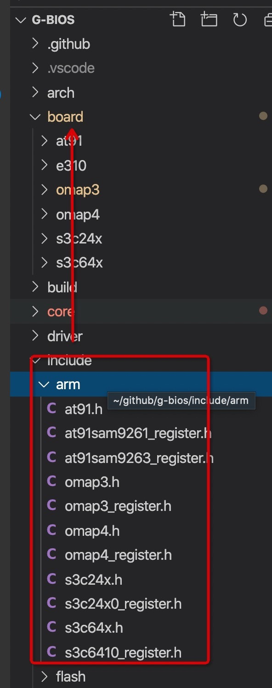
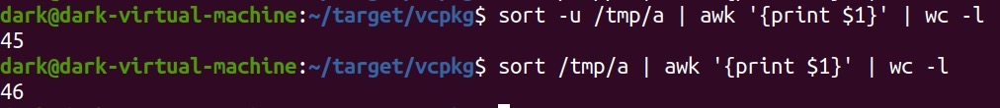
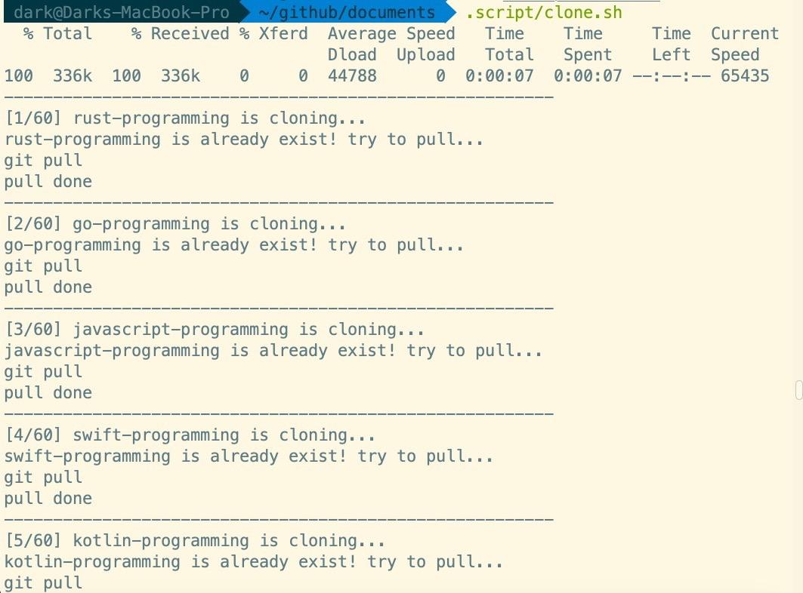
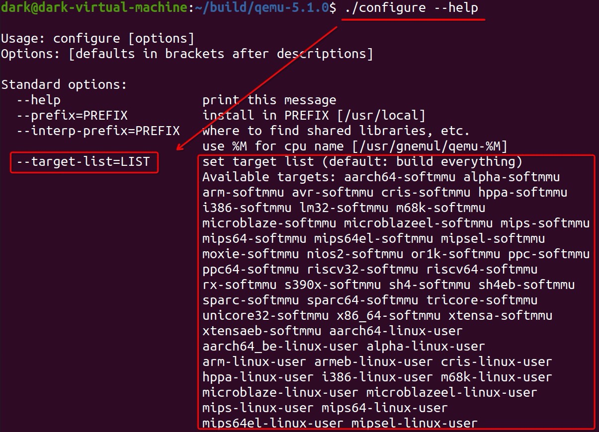
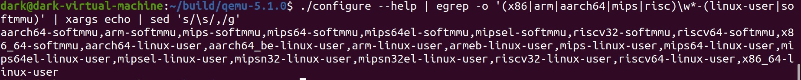
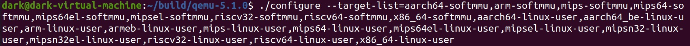

<h1>Shell Script</h1>

- [1. 文件目录递归](#1-文件目录递归)
- [2. 目录移动](#2-目录移动)
- [3. ECS脚本](#3-ecs脚本)
- [4. CCVM](#4-ccvm)
- [5. 列表去重](#5-列表去重)
- [6. 批量化Git操作: clone & pull](#6-批量化git操作-clone--pull)
  - [6.1. 第一次迭代: 本地数据(写死src.list)](#61-第一次迭代-本地数据写死srclist)
    - [6.1.1. clone](#611-clone)
    - [6.1.2. init](#612-init)
    - [6.1.3. pull](#613-pull)
  - [6.2. 第二次迭代: 舆情数据入门——GitHub/GitEE API](#62-第二次迭代-舆情数据入门githubgitee-api)
    - [6.2.1. GitHub](#621-github)
      - [6.2.1.1. clone & pull](#6211-clone--pull)
      - [6.2.1.2. init](#6212-init)
    - [6.2.2. GitEE](#622-gitee)
      - [6.2.2.1. create repos](#6221-create-repos)
      - [6.2.2.2. clone and pull](#6222-clone-and-pull)
      - [6.2.2.3. repo init](#6223-repo-init)
      - [6.2.2.4. add member](#6224-add-member)
      - [6.2.2.5. delete member](#6225-delete-member)
      - [6.2.2.6. delete repo](#6226-delete-repo)
- [7. Toolchain Build by Crosstool-NG](#7-toolchain-build-by-crosstool-ng)
  - [7.1. build Cross Toochain on new machine](#71-build-cross-toochain-on-new-machine)
  - [7.2. CT-NG编译多架构Toolchain](#72-ct-ng编译多架构toolchain)
- [8. Configure the qemu target list](#8-configure-the-qemu-target-list)
- [9. 命令行参数解析](#9-命令行参数解析)
  - [9.1. raw](#91-raw)
  - [9.2. getopts](#92-getopts)
- [10. Progress Bar](#10-progress-bar)

# 1. 文件目录递归
目的: 对指定目录内容进行遍历，并输出目录结构，效果参考tree命令.

```bash
#!/usr/bin/env bash

print_n_tab_to_menu(){
    i=2
    echo -n "|---" >> README.md
    while ((i<$1)); do
        echo -n "----" >> README.md
        ((i=$i+1))
    echo -n "--->" >> README.md
    done 
}

print_basename_to_menu(){
    echo `basename $1` >> README.md
}

# function: main(my ls)
tc=1
main(){
    if [ ! -d $1 ]; then
        print_n_tab_to_menu $tc
        print_basename_to_menu $1
        return
    fi
    
    print_n_tab_to_menu $tc
    print_basename_to_menu $1
    ((tc=$tc+1))
    for d in `ls $1`; do
        main ${1}/${d}
    done
    ((tc=$tc-1))
}

rm README.md && touch README.md

cat README.md.bk >> README.md
echo "\`\`\`" >> README.md
main $1
echo "\`\`\`" >> README.md
```

# 2. 目录移动
目的: g-bios项目下，移动board相关的include到board目录下


最终通过脚本变为:
```
1	board/
2	├── at91
3	│   ├── clock.S
4	│   ├── delay.S
5	│   ├── gpio.c
6	│   ├── include
7	│   │   ├── at91.h
8	│   │   ├── at91sam9261_register.h
9	│   │   └── at91sam9263_register.h
10	│   ├── Makefile
11	│   ├── memory.ld
12	│   └── sdram.S
13	├── built-in.o
14	├── e310
15	│   ├── gpio.c
16	│   ├── include
17	│   │   └── e310.h
18	│   ├── Makefile
19	│   └── memory.ld
20	├── Makefile
21	├── omap3
22	│   ├── clock.c
23	│   ├── delay.S
24	│   ├── include
25	│   │   ├── omap3.h
26	│   │   └── omap3_register.h
27	│   ├── Makefile
28	│   └── memory.ld
29	├── omap4
30	│   ├── clock.c
31	│   ├── include
32	│   │   ├── omap4.h
33	│   │   └── omap4_register.h
34	│   ├── Makefile
35	│   ├── memory.ld
36	│   └── sdram.c
37	├── s3c24x
38	│   ├── built-in.o
39	│   ├── clock.c
40	│   ├── clock.o
41	│   ├── delay.o
42	│   ├── delay.S
43	│   ├── include
44	│   │   ├── s3c24x0_register.h
45	│   │   └── s3c24x.h
46	│   ├── Makefile
47	│   └── memory.ld
48	└── s3c64x
49	    ├── clock.c
50	    ├── include
51	    │   ├── s3c6410_register.h
52	    │   └── s3c64x.h
53	    ├── Makefile
54	    └── memory.ld
```
注意line 6、16、24...的include目录

```bash
for plat in board/*; do pn=${plat#board/}; echo $pn; mkdir -vp $plat/include; if [ $pn = e310 ]; then arch=risc-v; else arch=arm; fi; for h in `ls include/$arch/$pn*`; do git mv $h $plat/include/; done; done
```

# 3. ECS脚本
目的:
1. 动态检测ECS系统软硬件配置，包括OS版本、私网IP、CPU、RAM、Disk
2. 公网和私网两种网络连接方式的性能差异（benchmark）
3. 检测各ECS主机的连通性
4. 循环ssh-copy-id
   
```bash
#!/usr/bin/env bash

env=$1
hosts=host.$env
if [ ! -e $hosts ]; then
    echo "no $hosts"
    exit 1
fi

hostgroup=(`cat $hosts`)
privgroup=()

echo "Getting ECS info ..."
for ((i=0;i<${#hostgroup[@]};i++)); do
    host=${hostgroup[$i]}

    priv=`ssh root@$host ifconfig eth0 | grep -w inet | awk '{print $2}'`
    privgroup+=($priv)

    echo "[$((i+1))/${#hostgroup[@]}] $host, $priv"
    for cmd in \
        "lsb_release -d" \
        "lscpu | grep -w '^CPU(s)'" \
        "lsmem | grep 'online memory'" \
        "fdisk -l | grep -o '^Disk /dev.*GiB'"
    do
        info=`ssh root@$host "$cmd | sed 's/\s\+/ /g'"`
        echo "      $info"
    done
done
echo

echo "Benchmark ..."
host=${hostgroup[0]}
for ((i=1;i<${#hostgroup[@]};i++)); do
    echo "public:"
    ssh root@$host ping -c 3 ${hostgroup[$i]} | egrep -o 'time=[\.0-9]+'
    echo "private:"
    ssh root@$host ping -c 3 ${privgroup[$i]} | egrep -o 'time=[\.0-9]+'
done
echo

echo "Checking connectivity ..."
for ((i=0;i<${#hostgroup[@]};i++)); do
    host=${hostgroup[$i]}
    echo $host
    for ((j=0;j<${#hostgroup[@]};j++)); do
        [ $i == $j ] && continue
        target_host=${hostgroup[$j]}
        target_priv=${privgroup[$j]}
        ssh root@$host "ping -c 3 $target_priv > /dev/null"
        if [ $? == 0 ]; then
            result=OK
        else
            result=Failed
        fi
        echo "  ==> $target_host: $result"
    done
done
```
```bash
#!/bin/bash

env=$1
hosts=host.$env
if [ ! -e $hosts ]; then
    echo "no $hosts"
fi

hostgroup=(`cat $hosts`)

for i in ${hostgroup[@]}; do
    ssh-copy-id root@$i
done
```

# 4. CCVM
目的: <!-- FIXME -->

```bash
#!/usr/bin/env bash

if [ $# != 1 ]; then
	echo "usage: $0 <toolchain>"
	exit 1
fi

toolchain=$1

tcbin=$HOME/x-tools/$toolchain/bin

if [ ! -e $tcbin ]; then
	echo "invalid toolchain '$toolchain'"
	exit 1
fi

for bin in $tcbin/*
do
	bn=`basename $bin`
	current=`echo $bn | sed 's/\(\w\+\)-\w\+-\(\w\+\)-\w\+-\(.*\)/\1-\2-\3/'`
	ln -sf $bin /usr/local/bin/$current
done

echo "current: $toolchain"

```

# 5. 列表去重
目的: 给如下文件内容去重
```
Agile敏捷开发	QR code	URL
数据库技术	QR code	URL
体系结构	QR code	URL
数据结构	QR code	URL
文档与工具	QR code	URL
计算机组成与操作系统	QR code	URL
计算机网络	QR code	URL
单元测试	QR code	Java1 Java2 C/C++
Firmware & Bootloader	QR code	URL
系统管理	QR code	URL
C/C++最佳实践	QR code	URL
Java程序设计	QR code	URL1 URL2
设计模式	QR code	URL
Linux/macOS/Windows	QR code	URL
C-like程序设计	QR code	URL
C/C++程序设计	QR code	URL
Java最佳实践	QR code	URL
JavaScript程序设计	QR code	URL
JavaScript最佳实践	QR code	URL
Python程序设计	QR code	URL
Python最佳实践	QR code	URL
DevOps	QR code	URL
Linux Kernel	QR code	URL
RTOS与低功耗	QR code	URL
H5与前端框架	QR code	URL
面试	QR code	URL
总线与I/O技术	QR code	URL
虚拟化技术	QR code	URL
全栈技术（JavaScript版）	QR code	URL
全栈技术（Java版）	QR code	URL
全栈技术（Python版）	QR code	URL
嵌入式系统构建	QR code	URL
MS & SM	QR code	URL
中国文学史	QR code	URL
Hackintosh	QR code	URL
技术沙龙	QR code	URL
程序优化	QR code	URL
Docker容器技术	QR code	URL
Kubernetes & PaaS	QR code	URL
虚拟化技术	QR code	URL
OpenStack & IaaS	QR code	URL
中间件技术	QR code	URL
iOS & Android	QR code	URL
Spark	QR code	URL
Hadoop	QR code	URL
IoTHub
```

```bash
sort -u /tmp/a | awk '{print $1}'
```

一个命令看出去重效果:


# 6. 批量化Git操作: clone & pull 
应用场景: 最近开始全面复习，每个课程都建立了相应的repo进行协同资料整理，所以大量的clone和pull以及子课程目录的初始化工作肯定避免不了，这里是批量clone & pull & init脚本的几个小迭代。

## 6.1. 第一次迭代: 本地数据(写死src.list)
### 6.1.1. clone
demo1
```bash
#!/usr/bin/env bash

url_list=(digital fpga dart risc-v mq design-pattern data-structure os c-like wireless emulator sensor ecc rust bootloader micropython linux-kernel io arm agile shell hackintosh network python devkit)

for url in ${url_list[@]}; do
    while true; do
        git clone git@github.com:wit-course/${url}.git && break
    done
done
```

demo2
```bash
#!/usr/bin/env bash
for url in `cat src.list`; do
    while true; do
        git clone $url && break
    done
done
```

src.list
```url
git@github.com:wit-course/digital.git
git@github.com:wit-course/fpga.git
git@github.com:wit-course/dart.git
git@github.com:wit-course/risc-v.git
git@github.com:wit-course/mq.git
git@github.com:wit-course/design-pattern.git
git@github.com:wit-course/data-structure.git
git@github.com:wit-course/os.git
git@github.com:wit-course/c-like.git
git@github.com:wit-course/wireless.git
git@github.com:wit-course/emulator.git
git@github.com:wit-course/sensor.git
git@github.com:wit-course/ecc.git
git@github.com:wit-course/rust.git
git@github.com:wit-course/bootloader.git
git@github.com:wit-course/micropython.git
git@github.com:wit-course/linux-kernel.git
git@github.com:wit-course/io.git
git@github.com:wit-course/arm.git
git@github.com:wit-course/agile.git
git@github.com:wit-course/shell.git
git@github.com:wit-course/hackintosh.git
git@github.com:wit-course/network.git
git@github.com:wit-course/python.git
git@github.com:wit-course/devkit.git
```

简要分析: 该模块通过一个写死的src.list或者课程名数组来批量clone repo，问题在于云端更新无法及时获取，没有达到真正的自动化。

### 6.1.2. init
demo1
```bash
#!/usr/bin/env bash

for dir in `ls`; do
    if [ -d $dir ]; then
        touch ${dir}/README.md
    fi
done
```

简要分析: 该模块目的在于repo下子目录的README.md初始化工作，目前是简单的在目录下生成README.md文件，下一迭代的目标是只在空目录下生成README.md。

### 6.1.3. pull
demo1
```shell
#!/usr/bin/env bash

# 1. get all directory
# dir_list=(`ls -l | grep "^d" | awk '{print $9}'`)
dir_list=(`ls -F | grep "/$"`)

# 2. get all git repo from dir_list, then insert it into git_repo_list
count=0
git_repo_list=()
for dir in ${dir_list[@]}; do
    if [ -d ${dir%/}/.git ]; then
        git_repo_list[$count]=${dir%/} 
        count=`expr $count + 1`
    fi
done

# 3. pull all
i=1
for dir in ${git_repo_list[@]}; do
    echo "[${i}/${count}] ${dir} is pulling..."

    cd ${dir}
    while true; do
        git pull && break
    done
    cd ..

    i=`expr $i + 1`
done

```

简要分析: 从当前目录通过条件: .git是否存在来得到所有的git repo，并逐一pull。
大致分为三步: 
1. 获取当前目录下所有的目录名 
2. 筛选出所有的git repo 
3. pull

## 6.2. 第二次迭代: 舆情数据入门——GitHub/GitEE API
### 6.2.1. GitHub
#### 6.2.1.1. clone & pull
```bash
#!/usr/bin/env bash

# get the repo list from github
url_list=(`curl -u dark-w:Wangdake2020 -H "Accept: application/vnd.github.v3+json" -G -d "per_page=100"  https://api.github.com/orgs/wit-course/repos | grep "^    \"name" | awk '    {print $2}' | sed 's/\"//g' | sed 's/\,//g'`)

# url_list=(`cat url.list`)

# clone & pull
echo '--------------------------------------------------------'
for ((i = 0; i < ${#url_list[@]}; i++)); do
    echo "[`expr $i + 1`/${#url_list[@]}] ${url_list[i]} is cloning..."
    if [ ! -d ${url_list[i]} ]; then
        while true; do
            echo git clone git@github.com:wit-course/${url_list[i]}.git && break
        done
        echo 'clone done'
    else
        echo "${url_list[i]} is already exist! try to pull..."
        if [ ! -d ${url_list[i]}/.git ]; then
            echo "pull failed: it's not a git repo!"
        else
            cd ${url_list[i]}
            while true; do
                echo git pull && break
            done
            cd ..
            echo 'pull done'
        fi
    fi
    echo '--------------------------------------------------------'
done
```

简要分析: 首先通过curl命令发送GET请求远程调用GitHub API并获得repolist，过滤得到课程名程后循环判断每一个元素(课程名)在当前目录下是否存在，如果不存在则clone，如果存在该目录则判断是否为git repo，如果是则pull it，反之则报错并继续下一次循环。

执行:


正式运行请去掉clone & pull的两个echo

#### 6.2.1.2. init
<!-- FIXME -->

### 6.2.2. GitEE
注意事项:
1. 注意access_token需要更换。
2. MacOS下使用egrep -o xxx，Ubuntu下使用grep -P -o xxx，这是BSD与GNU的区别，最终目标是设置非贪婪匹配。

#### 6.2.2.1. create repos
x-hero-crepos
```bash
#!/usr/bin/env bash

for rn in `cat x-hero-reponame.list`; do
    curl -X POST --header 'Content-Type: application/json;charset=UTF-8' 'https://gitee.com/api/v5/orgs/x-hero/repos' -d '{"access_token":"10147de3dfd18eae7e277851c8a3f419","name":"'${rn}'","has_issues":"true","has_wiki":"true","can_comment":"true","public":2,"private":"false","path":"'${rn}'"}'
done

```
x-hero-reponame.list
```
c-programming
cpp-programming
cc-practice
shell
data-structure
os
network
virt
design-pattern
linux-system-build
wireless
arm
risc-v
bootloader
bus
simulator
interview
cc-embedded
micropython
```

#### 6.2.2.2. clone and pull
运行方式:
```bash
./x-hero-cap YOUR_PERSONAL_ACCESS_TOKEN
```
x-hero-cap
```bash
#!/usr/bin/env bash

url_list=(`curl -X GET --header 'Content-Type: application/json;charset=UTF-8' "https://gitee.com/api/v5/orgs/x-hero/repos?access_token=$1&type=private&page=1&per_page=20" | egrep -o "full_name.*?," | awk -F '/' '{print $2}' | awk -F '\"' '{print $1}'`)

echo '---------------------------------------------------------------------'
for ((i=0;i<${#url_list[@]};i++)); do
    if [ ! -d ${url_list[i]} ]; then
        echo "${url_list[i]} is cloning..."
        while true; do  
            git clone git@gitee.com:x-hero/${url_list[i]}.git && break
        done
        echo 'clone done'
    else
        echo "${url_list[i]} is already exist! try to pull..."
        if [ ! -d ${url_list[i]}/.git ]; then
            echo "pull failed: it's not a git repo!"
        else
            cd ${url_list[i]}
            while true; do
                git pull && break
            done
            cd ..
            echo 'pull done'
        fi
    fi
    echo '---------------------------------------------------------------------'
done

```

#### 6.2.2.3. repo init
x-hero-repoinit
```bash
#!/usr/bin/env bash

url_list=(`curl -X GET --header 'Content-Type: application/json;charset=UTF-8' 'https://gitee.com/api/v5/orgs/x-hero/repos?access_token=10147de3dfd18eae7e277851c8a3f419&type=private&page=1&per_page=20' | egrep -o "full_name.*?," | awk -F '/' '{print $2}' | awk -F '\"' '{print $1}'`)

# dir_list=(`ls -l | grep "^d" | awk '{print $9}'`)

echo '------------------'
for ((i=0;i<${#url_list[@]};i++)); do
    if [ -d ${url_list[i]} ]; then
        if [ ! -f ${url_list[i]}/README.md ]; then
            echo "${url_list[i]} is initing..."
            touch ${url_list[i]}/README.md
            echo 'init done, try to commit and push'
            cd ${url_list[i]}
            git add *
            git commit -asm "init"
            while true; do
                git push && break
            done
            cd .. 
            echo 'push done'
        else
            echo "${url_list[i]} is already inited!"
        fi
        echo '------------------'
    fi
done

```

#### 6.2.2.4. add member
x-hero-add-member
```bash
#!/usr/bin/env bash

username=$1

url_list=(`curl -X GET --header 'Content-Type: application/json;charset=UTF-8' 'https://gitee.com/api/v5/orgs/x-hero/repos?access_token=10147de3dfd18eae7e277851c8a3f419&type=private&page=1&per_page=20' | egrep -o "full_name.*?," | awk -F '/' '{print $2}' | awk -F '\"' '{print $1}'`)

for ((i=0;i<${#url_list[@]};i++)); do
    curl -X PUT --header 'Content-Type: application/json;charset=UTF-8' "https://gitee.com/api/v5/repos/x-hero/${url_list[i]}/collaborators/${username}" -d '{"access_token":"10147de3dfd18eae7e277851c8a3f419","permission":"push"}'
done

```

#### 6.2.2.5. delete member
<!-- FIXME -->

#### 6.2.2.6. delete repo
x-hero-drepos
```bash
#!/usr/bin/env bash

url_list=(`curl -X GET --header 'Content-Type: application/json;charset=UTF-8' 'https://gitee.com/api/v5/orgs/x-hero/repos?access_token=10147de3dfd18eae7e277851c8a3f419&type=private&page=1&per_page=20' | egrep -o "full_name.*?," | awk -F '/' '{print $2}' | awk -F '\"' '{print $1}'`)

for ((i=0;i<${#url_list[@]};i++)); do
    curl -X DELETE --header 'Content-Type: application/json;charset=UTF-8' "https://gitee.com/api/v5/repos/x-hero/${url_list[i]}?access_token=10147de3dfd18eae7e277851c8a3f419"
done

```

# 7. Toolchain Build by Crosstool-NG
## 7.1. build Cross Toochain on new machine
```bash
echo 'need: memory >= 4096, disk capacity >= 20G (has passed the test)'
echo 'pls remove the sudo passwd'

# update apt source
sudo mv /etc/apt/sources.list /etc/apt/sources.list.bk && sudo touch /etc/apt/sources.list
echo "deb http://mirrors.aliyun.com/ubuntu/ bionic main restricted universe multiverse
    deb http://mirrors.aliyun.com/ubuntu/ bionic-security main restricted universe multiverse
    deb http://mirrors.aliyun.com/ubuntu/ bionic-updates main restricted universe multiverse
    deb http://mirrors.aliyun.com/ubuntu/ bionic-proposed main restricted universe multiverse
    deb http://mirrors.aliyun.com/ubuntu/ bionic-backports main restricted universe multiverse
    deb-src http://mirrors.aliyun.com/ubuntu/ bionic main restricted universe multiverse
    deb-src http://mirrors.aliyun.com/ubuntu/ bionic-security main restricted universe multiverse
    deb-src http://mirrors.aliyun.com/ubuntu/ bionic-updates main restricted universe multiverse
    deb-src http://mirrors.aliyun.com/ubuntu/ bionic-proposed main restricted universe multiverse
    deb-src http://mirrors.aliyun.com/ubuntu/ bionic-backports main restricted universe multiverse" | sudo tee /etc/apt/sources.list
sudo apt update

# install dependencies
sudo apt install -y flex bison texinfo help2man gawk libtool-bin libncurses5-dev g++ make dh-autoreconf unzip

# build and install ct-ng
tar xvf /vagrant/crosstool-ng-1.24.0.tar.bz2 -C $HOME/
cd crosstool-ng-1.24.0
./configure
make
sudo make install

# build toolchain
mkdir -p $HOME/toolchain-build/.build
cd $HOME/toolchain-build
ct-ng arm-cortexa9_neon-linux-gnueabihf 
sed -i 's#\(CT_LOCAL_TARBALLS_DIR\)=.*#\1="/vagrant"#' .config
ct-ng build
```

## 7.2. CT-NG编译多架构Toolchain
```bash
#!/usr/bin/env bash
for target in \
	arm-unknown-linux-gnueabi \
	arm-cortex_a15-linux-gnueabihf \
    aarch64-unknown-linux-gnu \
	riscv32-unknown-elf \
	riscv64-unknown-linux-gnu		
do
	ct-ng $target
	# replace with the real download path
	sed -i 's#\(CT_LOCAL_TARBALLS_DIR\)=.*#\1="/home/dark/build/toolchain-multi"#' .config
	ct-ng build
done
```

# 8. Configure the qemu target list
目的: 源码编译qemu时，需要配置target list，数据源是configure中的帮助信息，我们需要过滤出来需要的那部分。

实现过程:

full target list:


configure the part you want:
```bash
./configure --help | egrep -o '(x86|arm|aarch64|mips|risc)\w*-(linux-user|softmmu)' | xargs echo | sed 's/\s/,/g'
```

执行以上脚本输出:


最终配置:


# 9. 命令行参数解析
## 9.1. raw
```bash
#!/usr/bin/env bash

if [ $UID != 0 ]; then
    echo "must be run as root!"
    exit 1
fi

function usage() {
    echo "usage: $0 --access-token/-a <access token> --name/-n <member name>"
}

while [[ $# -gt 0 ]]; do
    case $1 in
    -a|--access-token )
        access_token=$2
        shift
        ;;
    -n|--name )
        name=$2
        shift
        ;;
    -h|--help )
        usage
        exit 0
        ;;
    * )
        echo "invalid option '$1'"
        exit 1
        ;;
    esac

    shift
done

if [ -z "$access_token" -o -z "$name" ]; then
    usage
    exit 1
fi

echo $access_token
echo $name

```

## 9.2. getopts
```bash
#!/usr/bin/env bash

function usage() {
    echo "usage: $0 -a <access_token> -n <member_name>"
}

while getopts "a:hn:" OPT; do
    case $OPT in
    a )
        access_token=$OPTARG
        ;;
    h )
        usage
        exit 0
        ;;
    n )
        member_name=$OPTARG
        ;;
    ? )
        usage
        exit 1
        ;;    
    esac
done

if [ -z "$access_token" -o -z "$member_name" ]; then
    usage
    exit 1
fi

echo $access_token
echo $member_name

```

# 10. Progress Bar
1. 使用printf实现不断覆盖当前行输出，已到达动态效果
```bash
#!/usr/bin/env bash

i=0
for ((;i<100;i++)); do
    printf "%d\r" $i
    sleep 0.01
done
printf "%d\n" $i

```

2. 添加进度条效果
```bash
#!/usr/bin/env bash

i=0
str='*'
pro=('/' '|' '-' '\')

for ((;i<100;i++)); do
    let index=i%4
    printf "[%-100s %d%% %c]\r" "$str" "$i" "${pro[$index]}" 
    str+='*'
    sleep 0.02
done
printf "[%s %d%% -]\n" "$str" "$i" 

```
